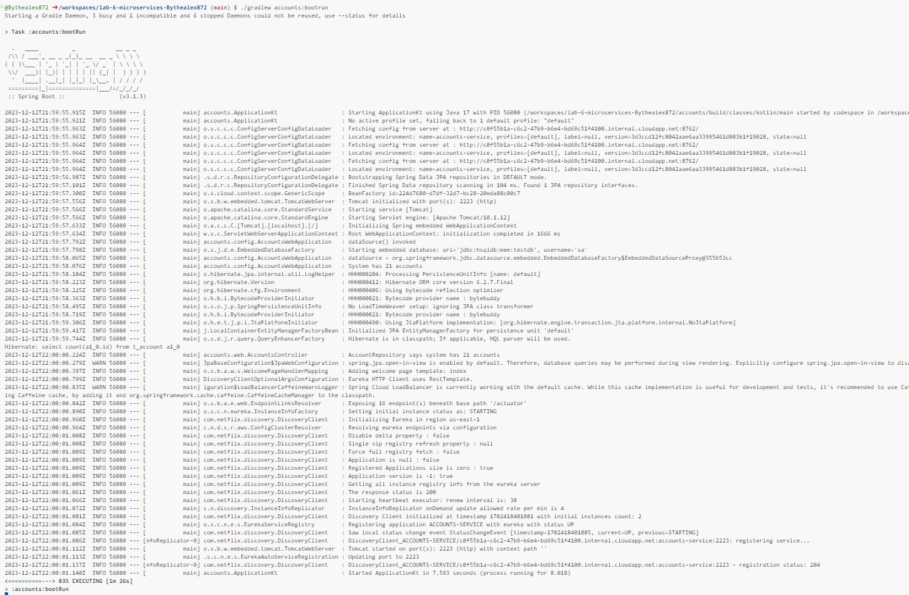
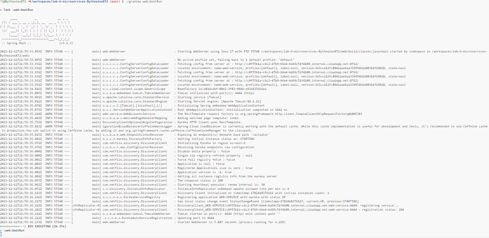
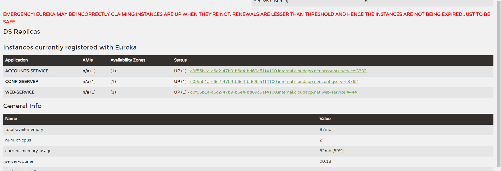
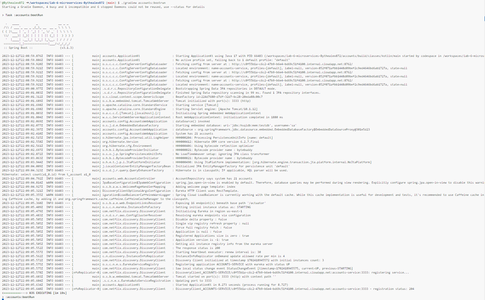
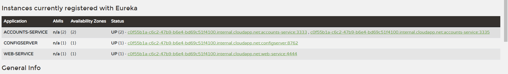
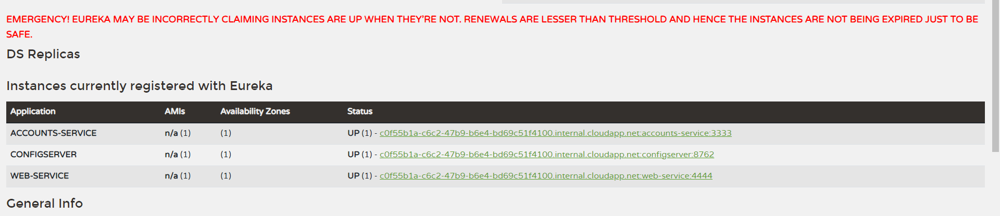

In this assigment we will deploy an application based on a microservice architecture.

The first step will be launching the config service, as we can see on the code the config service use as configuration file one file located in an other github repository so we have to modify this so it uses our own repository 
```yaml
server:
  port: 8762

spring:
  application:
    name: configserver
  cloud:
    config:
      server:
        git:
          uri: https://github.com/Bythealex872/lab6-microservices-config-repo/

eureka:
  client:
    serviceUrl:
      defaultZone: http://localhost:8761/eureka/
```

After changing this we will launch the services using ```
./gradlew discovery:bootRun ``` and ``` ./gradlew config:bootRun``` after that we can launch the accounts service and the web service using ```./gradlew accounts:bootRun``` and ``` ./gradlew web:bootRun```.

We should get this terminal output:



After this we can check on eureka if the services are launched and detected.



Now we will update the remote repository were the configuration of the accounts service is defined so it launches on a different port 
```
https://github.com/Bythealex872/lab6-microservices-config-repo/commit/852f071afbb1448d09bef2c9ed4646bd6ab1727a
```
Now we will run a second instance of accounts using the same command as before 
```
./gradlew accounts:bootRun
```


If we go check on Eureka we will see we have now 2 different instances of the service accounts



Note : On my eureka the ports might be different because of some problems taking the screenshoot.

If we now kill the first accounts service our service discovery system will detect that that service has died and will redirect all the petitions to the second accounts service so if we now make a request we will be asnwered by ther service running on the port 3333



We can see there is only 1 instance of the microservice running.